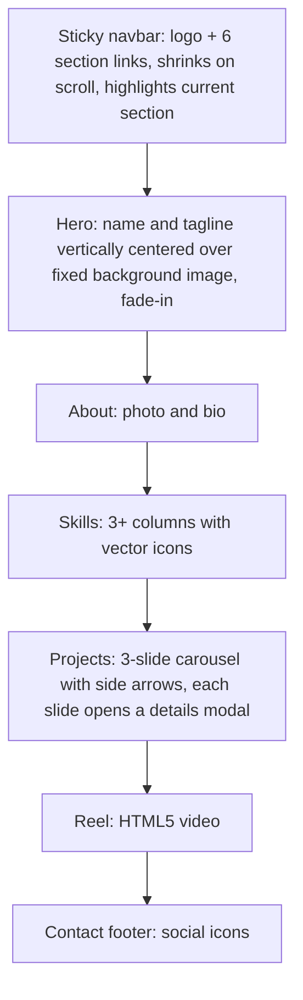
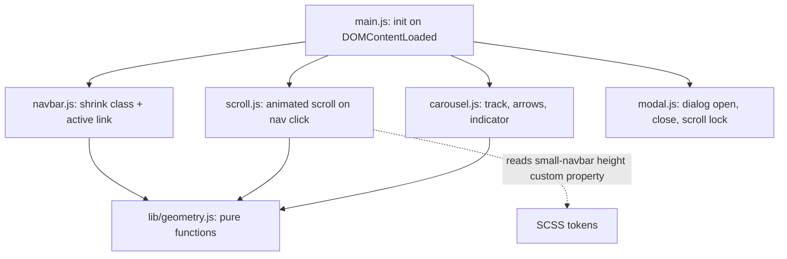
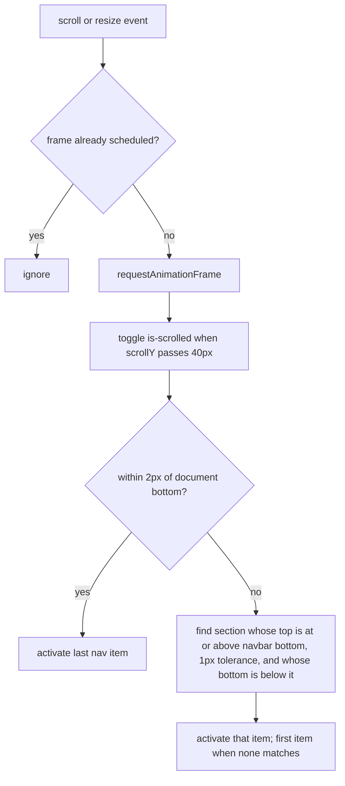

# MP1 Portfolio Page - Plan

## Goal Capsule

- **Objective:** Turn the untouched CS 409 MP1 template into a single-page personal portfolio for Raymond Burt that earns full marks on all 16 assignment requirements, deployed on GitHub Pages, by Tuesday 2026-09-22 11:59 PM CT.
- **Authority:** `README.md` is binding. Below it, the Product Contract defines what to build and the Planning Contract defines how. Raymond decides content, look, and anything the README leaves open. Where this plan and the README disagree, the README wins.
- **Execution profile:** A two-day solo course build on the existing webpack template. Hand-written HTML, SCSS, and ES6 only. Work the units in dependency order, with U2 first.
- **Stop conditions:** Stop and ask Raymond before pushing to the public repo, before changing anything on his GitHub account, and if a requirement can only be met with a library or a new runtime dependency.
- **Tail ownership:** The executor builds, verifies, commits, and, after Raymond confirms, pushes to `main`, which is the branch the Pages workflow deploys. Raymond owns enabling Pages, swapping in real content, the demo video, the form, and the closing log commit, all listed in `docs/submission-checklist.md`.
- **Open blockers:** None. One non-blocking question about the repo name sits under Deferred / Open Questions.

---

## Product Contract

### Summary

Build a dark, technical single-page portfolio in the "classic stripes" shape: Hero, About, Skills, Projects, Reel, Contact, under a sticky navbar that shrinks on scroll and tracks reading position. All behavior is hand-written HTML, SCSS, and vanilla JavaScript on the existing webpack template. Every LLM exchange used to build it is logged to `llm_logs.csv` automatically.

### Problem Frame

The repo is the course template as cloned: `src/index.html` shows "Hello World", `src/css/main.scss` is empty, and `src/js/main.js` logs one line. Webpack, SCSS compilation, asset copying, and the GitHub Pages workflow already work. The deadline is two days out, and an undeployed site caps the grade at 80%.

The course permits LLM-generated code only if chat logs are submitted with the source. Missing logs are an academic-integrity violation, so logging cannot depend on anyone remembering to do it.

### Key Decisions

- **Subject: personal portfolio.** (session-settled: user-directed — chosen over a fictional product page or a hobby site: real, reusable, and the carousel and modals map onto projects.)
- **Page shape: classic stripes.** (session-settled: user-directed — chosen over a projects-first card grid and a story/timeline layout: little work history to fill a timeline, and one project is a GitHub repo with no screenshots to fill a gallery.)
- **Look: dark and technical with UIUC accents.** (session-settled: user-directed — chosen over light-minimal and bold-colorful.) Illini Orange (`#FF5F05`) is the primary accent. Illini Blue (`#13294B`) is too dark to read as an accent on a near-black page, so it serves as a surface and stripe tint.
- **Placeholder-first content.** (session-settled: user-directed — chosen over waiting for real assets: the deadline is close.) Photo, bio, and two website projects are placeholders. The third project is Jukeplox with its real GitHub link.
- **FontAwesome and a webfont are the only third-party code or stylesheets.** The README names FontAwesome in requirement 15 and webfonts in its task description, so icon and font resources do not violate the no-libraries rule. Freely licensed media assets are allowed and recorded under R21. Carousel, modal, smooth scrolling, and scroll tracking are hand-written.
- **The log is generated from session transcripts, not written by hand.** A script rebuilds `llm_logs.csv` from Claude Code's recorded sessions and runs automatically at the end of every turn. Regenerating from the source of truth means a response missed by one run is captured by the next.
- **The deployed URL is `https://djrkod.github.io/cs409-mp1`.** The remote is `DJRkod/cs409-mp1`, not `mp1` as the README suggests. The repo keeps its name; asset paths stay relative so the subpath does not matter.

### Page Shape



### Requirements

**Page structure and navigation**

- R1. All content sits on one page as full-width horizontal stripes, with a header and a footer.
- R2. The navbar stays fixed to the top of the window while scrolling and links to every section.
- R3. The navbar is taller with larger text at the top of the page and shrinks, text included, once the user scrolls down. The change is animated.
- R4. The navbar highlights the section that lies directly under its bottom edge, updated on every scroll. A section is current when its top is at or above that edge, within a 1px tolerance, and its bottom is below it.
- R5. When the page is scrolled to the bottom, the last nav item is highlighted even if the last section is shorter than the window.
- R6. Clicking a nav item scrolls smoothly to that section and lands with the section's top flush against the navbar's bottom edge, with no strip of the previous section showing. The landing offset is the navbar's small-state height, because the navbar is small at every landing position except the page top.
- R29. Every stripe except the Contact footer is at least as tall as the viewport minus the small navbar at all five graded resolutions, so every nav target can reach the navbar's bottom edge and only Contact relies on R5.

**Sections**

- R7. Hero shows the name and tagline vertically and horizontally centered over a fixed-position background image. The text stays centered when the hero's height changes.
- R8. About shows a photo and a short bio.
- R9. Skills lays out at least three columns, each with a scalable vector icon.
- R10. Projects is a carousel of three slides with previous and next arrows on its sides. Arrows wrap from the last slide to the first and back. Each slide is a composed card: project title, one-line summary, tech tags, a visual, and the R11 details control. The visual is a placeholder image for the two website projects and a styled repo or terminal motif for Jukeplox. Slides change with an animated horizontal slide of roughly 400ms, and arrow clicks during a transition are ignored. Arrows are `button` elements with accessible labels and visible hover and focus states, and a "slide N of 3" indicator shows the position.
- R11. Each project slide has a control that opens a modal with more detail and the project's link. The modal closes by its close button, a click outside it, and the Escape key. The page behind does not scroll while it is open, and locking scroll does not shift the page or the navbar sideways. Opening moves focus to the close button, Tab stays inside the modal, and closing returns focus to the control that opened it. The modal has a dimmed backdrop and a short fade or scale transition. It is capped at the viewport height minus a margin and scrolls internally when its content is taller.
- R12. Reel embeds a video with the HTML5 `video` element and visible controls.
- R13. The footer shows social icons linking to `https://github.com/DJRkod` and `https://www.linkedin.com/in/raymond-burt-26594b262/`.
- R14. Content in every stripe is horizontally centered.

**Look and motion**

- R15. The page uses a dark palette with Illini Orange as the accent, consistent padding and margins across stripes, and one webfont pairing.
- R16. At least one CSS3 animation or transition is visible without interaction, and interactive elements have hover and focus states.
- R17. The page looks intentional at 1920x1080, 1366x768, 1280x720, 1024x768, and 768x1024: no horizontal scrollbar, no clipped or overlapping content, and the navbar stays usable.
- R30. 768px wide is a fully supported layout: any narrow-layout breakpoint sits strictly below 768px of viewport width, scrollbar included. At all five resolutions the navbar shows the logo and all six links on one line in both states, with no hamburger. Skills keeps at least three columns down to 768 wide. About is photo-beside-bio at 1024 wide and up and stacks photo-above-bio, centered, at 768. Carousel arrows stay inside the carousel's edges, vertically centered, without covering the slide's text or details control. The hero's name and tagline fit without clipping at 720 and 768 tall.

**Code rules**

- R18. Styles are written in SCSS and use variables, mixins, and nesting. Colors and spacing come from variables.
- R19. No inline `style` attributes, no inline `script` tags, no layout tables, and no JavaScript or CSS frameworks or libraries other than the FontAwesome and webfont resources allowed in Key Decisions.
- R20. Markup uses HTML5 semantic elements, and JavaScript is ES6 without globals leaking from modules.
- R21. No code is copied from outside sources. Every reference consulted and every third-party asset (icons, font, image, video) is recorded in one sources list for the submission form.

**LLM log compliance**

R22 through R25 and AE7 are already satisfied by `scripts/export_llm_logs.py` and the hooks in `.claude/settings.json`. Verify them once; do not rebuild them. Forward work in this group is R26.

- R22. `llm_logs.csv` holds every user prompt, assistant response, tool call, and tool result from every Claude Code session in this repo, with timestamp, session, and model.
- R23. The log regenerates automatically at the end of each assistant turn, on each prompt submission, and at session end, with no manual step.
- R24. A response missed by one run appears after the next run, and rows survive deletion of their source transcript.
- R25. Prompts, responses, and tool calls are logged in full. Tool results and injected skill text may be truncated to a stated length with a marker showing the original size. Email addresses other than ones that are already public, and the terms listed in the gitignored `.llm_log_redact.txt`, are redacted from every row on every run.
- R26. `llm_logs.csv` is committed with every push that contains LLM-generated code, and a final hand-made commit after the last session brings the pushed log fully up to date.

**Deployment and submission**

- R27. Pushing to `main` builds and deploys the site through the existing workflow, and the deployed page loads its image, video, icons, and fonts correctly under the `/cs409-mp1` subpath.
- R28. Placeholder content is easy to replace: swapping the photo, bio, project text, project links, and video needs no layout or script changes.
- R31. Placeholder content is submission-grade: a plausible bio, realistic project titles and descriptions, and a licensed or self-made photo stand-in and clip. No lorem ipsum and no empty boxes. The page can be recorded and submitted unchanged if real content does not arrive.
- R32. The repo contains a submission checklist for Raymond covering: the sources list from R21; a demo video of at most three minutes that shows the deployed URL first and then each graded feature; the Drive share with `uiuc.web.programming@gmail.com`; the submission form with its LLM survey; the final log commit from R26; the README's local-demo fallback of showing `git status` and `git log` on camera if deployment fails; and enabling GitHub Pages, which Raymond does once the site is ready, leaving margin for the README's 10 to 30 minute first go-live.

### Acceptance Examples

- AE1. **Covers R4, R5.** Given the page is scrolled so the Skills heading sits just under the navbar, the Skills nav item is highlighted and no other. Given the page is scrolled to the very bottom on a 1920x1080 window, Contact is highlighted even though the Reel section still occupies most of the window.
- AE2. **Covers R3.** Given the page is at the top, the navbar is in its large state. After scrolling down a short distance it transitions to the small state. Scrolling back to the top restores the large state.
- AE3. **Covers R4, R6, R29.** Given the user clicks any nav item, including from the very top of the page while the navbar is large, the page animates to that section, its heading is not hidden under the navbar, and that nav item ends up highlighted. Given a 1920x1080 window, clicking Reel ends with Reel highlighted, not Contact. Clicking Contact ends at the page bottom with Contact highlighted.
- AE4. **Covers R10.** Given slide 3 is showing, the next arrow shows slide 1. Given slide 1 is showing, the previous arrow shows slide 3.
- AE5. **Covers R11.** Given a project modal is open, pressing Escape closes it and returns focus to the control that opened it. While it is open, the mouse wheel does not scroll the page behind it. At 1280x720 all modal content and the close button are reachable, and the navbar does not move when the modal opens.
- AE6. **Covers R7.** Given the window is resized from 1920x1080 to 768x1024, the hero name and tagline remain centered vertically within the hero.
- AE7. **Covers R24.** Given the export ran while the assistant's final message was still being written, that message is absent from the CSV. After the next run it is present, and no earlier row is duplicated.

### Success Criteria

- Every line of the README grading breakdown can be demonstrated on the deployed URL inside a three-minute video.
- A grader reading `llm_logs.csv` can follow the whole build conversation in order without access to this machine.

### Scope Boundaries

- No working contact form or backend. Contact is links only.
- No light/dark theme toggle, no additional pages, no blog.
- No carousel auto-advance and no keyboard-arrow control. The README requires only side arrows.
- No phone-width layout below 768 px beyond not breaking. The rubric stops at 768x1024.
- Writing Raymond's real bio and project copy is his task, not part of the build.
- Recording the demo video, sharing it with `uiuc.web.programming@gmail.com`, filling in the submission form and its LLM survey, setting the repo's Pages source to "GitHub Actions", and making the final log commit after the last Claude Code session closes are Raymond's tasks. R32 owns the checklist for them.

### Dependencies / Assumptions

- The log exporter, `scripts/export_llm_logs.py`, and its hooks in `.claude/settings.json` already exist and work. Hooks created mid-session may not fire until `/hooks` is opened once or Claude Code restarts. Until then the script is run by hand at the end of each turn.
- The exporter reads transcripts from the Claude Code projects directory on this machine. Work done on another machine or in another LLM tool would need its logs added separately.
- Python 3 is on `PATH` for the hooks.
- `html-loader` resolves every local `src`, `poster`, and icon `href` in `src/index.html` as a webpack module, and `webpack.config.js` only handles eot, svg, ttf, woff, woff2, png, jpg, and gif. The asset rule is extended to mp4 and webm, plus any other extension actually used, before the Reel section is added. The README places no restriction on editing the build config.
- The log and its tooling are committed to a public repo. The CSV contains local file paths. The exporter redacts the user's email address on every run, so the guarantee does not depend on a one-time check.
- The reel uses a small placeholder clip, synthesized in the repo per KTD3 with one declared CC0 clip as the fallback, until Raymond supplies his own. Repo size stays reasonable for Pages.
- Assumption, unverified: the submission form accepts any deployed URL, so `cs409-mp1` instead of `mp1` costs nothing. If the form requires `/mp1`, renaming the GitHub repo fixes it without code changes.

### Sources / Research

- `README.md` holds the 16 requirements, the grading weights, the rules, and the submission steps.
- `webpack.config.js` copies `src/assets/` to the build output and injects the bundle into `src/index.html`. Files referenced from `src/index.html` go through `html-loader` and the asset rule, not only the copy plugin. SCSS is loaded through `src/index.js`.
- `.github/workflows/static.yml` builds with Node 20 and `npm ci`, then publishes the `build` directory.
- `src/assets/image.jpg` is the only asset in the template.

---

## Planning Contract

Product Contract preservation: changed. The four questions formerly under Outstanding Questions are resolved as KTD2, KTD3, KTD6, and a new Scope Boundaries entry, so that section is removed. No R-ID, AE-ID, or requirement text changed.

### Key Technical Decisions

- KTD1. **Modals use the native HTML5 `dialog` element opened with `showModal()`.** (session-settled: user-approved — chosen over a hand-built overlay `div`: the browser supplies the focus trap, focus return, Escape handling, and inert background that R11 demands.) Script adds only what `dialog` lacks: backdrop-click close, the scroll lock, initial focus on the close button, and a closing animation before `close()` runs. Escape is intercepted through the `cancel` event so the same animation plays.
- KTD2. **FontAwesome and the webfonts load from stylesheet links in the page head.** (session-settled: user-approved — chosen over npm packages bundled by webpack: a stylesheet matches the README's "scalable vector icons through CSS" and adds no package that could read as a library under rule 3.) Icons are FontAwesome CSS classes on `i` elements, never the FontAwesome JavaScript kit. FontAwesome's own CDN requires that kit, so the stylesheet comes from a CSS-only host such as cdnjs, pinned to one version and named in the sources list. `webpack.config.js` has no rule for plain `.css`, so a stylesheet link is also the path that needs no build change.
- KTD3. **Placeholder media is authored in this repo.** (session-settled: user-approved — chosen over downloaded stock media: nothing third-party to declare under rule 2.) The hero background, avatar, and project visuals are hand-written SVG files. The reel is a short clip synthesized by a Python and OpenCV script. If no browser-playable codec can be produced locally, fall back to one CC0 clip and record it in the sources list.
- KTD4. **A git pre-commit hook regenerates and stages `llm_logs.csv`.** (session-settled: user-approved — chosen over remembering to export before each commit: R26 becomes mechanical.) The hook lives in `.githooks/` and is activated with the repo-local `core.hooksPath` setting. An export failure blocks the commit.
- KTD5. **Raymond enables GitHub Pages at the end.** (session-settled: user-directed — chosen over a day-one deploy precondition.) Conflict call-out: until then every push to `main` fails at the workflow's deploy job, and subpath problems cannot be seen on the real URL. The build is therefore proven subpath-safe locally, by serving the `build` output from a `/cs409-mp1/` directory, before handoff.
- KTD6. **Smooth scrolling is a hand-written `requestAnimationFrame` animation with cubic easing.** CSS `scroll-behavior` is not set, so the two never compound. Duration scales with distance and is clamped between 400 and 900 ms. A wheel, touch, or key press cancels the animation. With `prefers-reduced-motion` the page jumps instead. It is worth 10% of the grade, and a visible eased animation demonstrates it unambiguously.
- KTD7. **The navbar is `position: fixed`, not `sticky`.** Its height change then never alters document height, so the shrink cannot oscillate at the threshold. It carries an `is-scrolled` class once `scrollY` passes 40px. Large and small heights are design tokens emitted as CSS custom properties, and script reads the small height from that property so R6 has one source of truth. Both heights are fixed `px` values, not `rem` and not `clamp()`, because an unregistered custom property reads back as authored text and the script parses it as a number.
- KTD8. **Position tracking is a pure function fed by one frame-throttled listener.** Scroll and resize events schedule a single `requestAnimationFrame` callback. It measures section rectangles and the navbar's live bottom edge, then asks a pure function for the active index. The page-bottom rule fires when `scrollY + innerHeight` is within 2px of the document height.
- KTD9. **The carousel is a flex track moved with a CSS transform transition.** A lock set on click and cleared on `transitionend`, with a timeout fallback, makes mid-transition clicks no-ops. Off-screen slides are `inert` so their details buttons leave the tab order. A polite live region announces "Slide N of 3".
- KTD10. **Scroll lock uses `scrollbar-gutter: stable` on the root element.** The gutter stays reserved when `overflow` is hidden, so neither the page nor the fixed navbar shifts when a modal opens.
- KTD11. **SCSS is split into `@use` partials with a token layer.** Tokens are SCSS maps emitted as CSS custom properties. Mixins cover the stripe container, centering, the focus ring, and breakpoints. The installed Sass is 1.38.2, so use `math.div` and avoid APIs newer than that release.
- KTD12. **Two breakpoints, both clear of the graded widths.** Media queries match the viewport including the scrollbar, but the window frame takes its share: a 1024-wide window yields about 1000 to 1008px of viewport, and a 768-wide window about 744 to 752px. Nothing between 768 and 1024 is graded. The narrow layout therefore starts below 700px and the About side-by-side layout starts at 900px, which leaves about 100px of margin on both sides. Type and spacing scale with `clamp()`, and every stripe shares one content max-width.
- KTD13. **Every asset path is relative.** No path starts with a slash, because the site is served from `/cs409-mp1/`. `url()` values in SCSS are written relative to `src/css/main.scss`, since `sass-loader` does not rewrite them per partial.
- KTD14. **Tests add no dependencies.** Pure JavaScript logic runs on Node's built-in test runner, and the exporter runs on Python `unittest`. DOM behavior is verified in a browser, because a DOM test harness would be a new dependency for a two-day build. Node 24 runs the ES module in `src/js/lib/geometry.js` from a `.mjs` test without a `type` field and prints a typeless-package warning. Do not add `"type": "module"` to `package.json` to silence it, because `webpack.config.js` and `postcss.config.js` are CommonJS and the build would break.
- KTD15. **Visual system.** Headings, nav, and labels use JetBrains Mono, and body text uses Inter. Stripes alternate between a near-black ground and an Illini Blue tint. Illini Orange is reserved for interactive and current-state elements. The hero carries a dark scrim so its text meets contrast over the pattern. R16 is met by a hero fade-up on load plus a looping scroll-cue animation that stays visible on camera.

### High-Level Technical Design

Module topology. `src/js/main.js` wires behavior modules to the DOM, and only `geometry.js` holds logic that is testable without a browser.



Per-frame position decision, which carries R4, R5, and AE1.



### Output Structure

```text
.claude/settings.json      modified
.githooks/pre-commit
.gitignore                 modified
docs/submission-checklist.md
package.json               modified
webpack.config.js          modified
scripts/export_llm_logs.py
scripts/test_export_llm_logs.py
scripts/make_placeholder_reel.py
src/index.html
src/index.js               unchanged
src/assets/            hero-grid.svg, avatar.svg, project-site-1.svg, project-site-2.svg,
                       project-jukeplox.svg, reel-poster.svg, reel.mp4 or reel.webm
src/css/main.scss
src/css/               _tokens.scss, _mixins.scss, _base.scss, _navbar.scss, _hero.scss,
                       _sections.scss, _carousel.scss, _modal.scss, _footer.scss
src/js/main.js
src/js/                navbar.js, scroll.js, carousel.js, modal.js
src/js/lib/geometry.js
tests/geometry.test.mjs
```

### Sequencing

U2 has no dependencies and lands first, so every later commit carries its log. U1 precedes all page work. U3 needs U1's asset rule. U4 needs U1 and U3. U5 and U6 both need U4 and do not depend on each other's behavior, but both edit `src/js/main.js`, `src/js/lib/geometry.js`, and `tests/geometry.test.mjs`, so they run one after the other, not in parallel. U7 is last.

### Risks

| Risk | Mitigation |
|---|---|
| OpenCV on this machine cannot write a codec that browsers play | U3 tries H.264 in `.mp4`, then VP9 or VP8 in `.webm`, and proves playback in a browser before it is done. The fallback is one CC0 clip, declared. |
| Pages is enabled last, so the real URL is untested until the end | KTD5 local subpath check in U7. The checklist tells Raymond to allow 10 to 30 minutes for the first go-live. |
| Dropbox locks `llm_logs.csv` during sync and the export fails silently | U2 adds a retry with an in-place fallback and makes hook failures visible. |
| Dropbox syncing `node_modules` slows or breaks builds | If a build fails on a locked file, pause Dropbox sync for the session rather than changing the build. |
| Two days to deadline | Units are ordered so the page is complete and demonstrable after U6. U7 is verification and paperwork. |

---

## Implementation Units

### U1. Build scaffolding and design tokens

- **Goal:** Make the template able to build the planned page, and lay down the SCSS foundation every section uses.
- **Requirements:** R15, R18, R19, R20, R27; KTD2, KTD11, KTD12, KTD13, KTD15.
- **Dependencies:** none.
- **Files:** `webpack.config.js`, `.gitignore`, `package.json`, `src/index.html`, `src/css/main.scss`, `src/css/_tokens.scss`, `src/css/_mixins.scss`, `src/css/_base.scss`.
- **Approach:** Widen the existing asset rule in `webpack.config.js` to include mp4, webm, and webp; change nothing else in it. Add `build/` to `.gitignore`. Add a `test` script to `package.json` that runs `node --test tests/geometry.test.mjs`. The file is named because Node 21 and later treat a bare directory argument as a module path and fail. Put the Google Fonts and FontAwesome stylesheet links in the head of `src/index.html`. Define tokens for color, the type scale, spacing, the content max-width, both navbar heights, and the two breakpoints, and emit them as CSS custom properties on the root. Write the stripe, center, focus-ring, and breakpoint mixins. The base partial holds the reset, typography, `scrollbar-gutter: stable`, and a reduced-motion rule.
- **Execution note:** This is configuration and scaffolding; prove it with a build and a dev-server smoke check rather than unit tests.
- **Patterns to follow:** the existing asset rule's regular-expression style in `webpack.config.js`; the import order already in `src/index.js`.
- **Test scenarios:** Test expectation: none -- configuration and style scaffolding with no behavior.
- **Verification:** `npm run build` succeeds with a throwaway `src/assets/test.mp4` file of any bytes and a throwaway `video` tag pointing at it in `src/index.html`, then both are removed. `git status` does not list `build/`. The dev server shows the webfonts applied and a FontAwesome icon rendering.

### U2. Log tooling: tests, visible failures, pre-commit hook

- **Goal:** Prove the exporter's guarantees, stop failures from passing silently, and make committing the log automatic.
- **Requirements:** R22, R23, R24, R25, R26, AE7; KTD4.
- **Dependencies:** none.
- **Files:** `scripts/export_llm_logs.py`, `scripts/test_export_llm_logs.py`, `.githooks/pre-commit`, `.claude/settings.json`.
- **Approach:** The exporter already meets R22 through R25. Refactor only enough to test it: let the transcript directory, output path, and redaction file be passed in instead of read from module constants. Wrap the final file replace in a short retry that falls back to writing in place when the file is locked. Add a hook mode that never raises and, on failure, prints a JSON `systemMessage` naming the error, then point the three hooks in `.claude/settings.json` at that mode and drop their error suppression. The pre-commit script runs the exporter in normal mode, stages `llm_logs.csv`, and exits non-zero when the export fails. Activate it with the repo-local `core.hooksPath` setting and mark the script executable in the index.
- **Execution note:** Add characterization tests for the current behavior before refactoring the exporter.
- **Test scenarios:**
  - A transcript with a typed prompt, an assistant text block, a tool call, and a tool result yields four rows with kinds prompt, response, tool_call, tool_result, in timestamp order.
  - A user entry flagged as meta yields a skill_context row. A slash command with non-empty arguments yields a prompt row, and one with empty arguments yields a command row.
  - A tool result longer than the cap is cut and ends with the truncation marker stating the original length. A long assistant response is never cut. The full flag disables cutting.
  - Thinking blocks and attachment entries produce no rows.
  - A sidechain entry gets the subagent prefix on its kind.
  - Covers AE7. Running twice over the same transcript yields identical rows with no duplicates. Appending one new entry and running again adds exactly one row.
  - A malformed final line is skipped without an error, and earlier rows still export.
  - Rows present in the CSV survive deletion of their source transcript file.
  - An email address that is not on the public list becomes the redaction marker, a term from the redaction file is scrubbed case-insensitively, and `uiuc.web.programming@gmail.com` is kept.
  - A CSV that still holds the template's two placeholder lines is replaced, not merged.
  - When the file replace raises a permission error on every retry, the in-place fallback still writes the rows.
  - In hook mode, a forced failure exits zero and prints JSON containing a `systemMessage`.
- **Verification:** The unittest suite passes. A commit made with a stale `llm_logs.csv` ends up containing the refreshed file. Temporarily pointing the exporter at an unwritable output path makes the pre-commit hook block the commit.

### U3. Placeholder media

- **Goal:** Produce every image and the reel clip the page references, authored in the repo and good enough to submit.
- **Requirements:** R7, R8, R10, R12, R21, R31; KTD3, KTD13.
- **Dependencies:** U1.
- **Files:** `scripts/make_placeholder_reel.py`, `src/assets/hero-grid.svg`, `src/assets/avatar.svg`, `src/assets/project-site-1.svg`, `src/assets/project-site-2.svg`, `src/assets/project-jukeplox.svg`, `src/assets/reel-poster.svg`, `src/assets/reel.mp4` or `src/assets/reel.webm`.
- **Approach:** Hand-write the SVG files in the dark, technical style: a grid or circuit pattern sized for full-bleed use as the fixed hero background, a monogram avatar, two browser-frame mockups for the website projects, and a terminal motif for Jukeplox. The reel script renders a few seconds of 1280x720 animated frames in the same palette and writes them with OpenCV, trying codecs in the order named under Risks. Keep the clip under 3 MB.
- **Execution note:** The codec question is only answerable by running the script and playing the file in a browser; do that first, because it decides the file extension the markup uses.
- **Test scenarios:** Test expectation: none -- generated assets; proof is visual and by playback.
- **Verification:** Through a throwaway `video` tag with `controls` and `poster` in `src/index.html`, removed afterwards, the reel plays in Chrome or Edge from the dev server and its poster shows before play. Each SVG renders at its intended size without external references. `npm run build` succeeds with the throwaway tag in place.

### U4. Page markup and section styling

- **Goal:** Build the complete static page: every stripe, the navbar in both visual states, carousel cards, and modal content, responsive at all five graded sizes.
- **Requirements:** R1, R2, R3, R7, R8, R9, R10, R11, R12, R13, R14, R15, R16, R17, R18, R19, R20, R28, R29, R30, R31, AE6; KTD1, KTD2, KTD7, KTD12, KTD15.
- **Dependencies:** U1, U3.
- **Files:** `src/index.html`, `src/css/main.scss`, `src/css/_navbar.scss`, `src/css/_hero.scss`, `src/css/_sections.scss`, `src/css/_carousel.scss`, `src/css/_modal.scss`, `src/css/_footer.scss`, `src/assets/image.jpg`.
- **Approach:** Semantic structure: a `header` holding the `nav`, a `main` holding one `section` per stripe with an id each nav link targets, and a `footer` for Contact. The hero is full viewport height with flex centering and the fixed-attachment SVG background under a scrim. Every other stripe except the footer takes the minimum height from R29 through the stripe mixin. Skills is a CSS grid that keeps three columns down to 768 wide. About switches from side-by-side to stacked at the 900px breakpoint. Each carousel slide is an `article` card, and each project's detail lives in its own `dialog` in the markup, so R28 content swaps touch only HTML. Bio, skills, and project copy are plausible and specific, never lorem ipsum. The navbar's two states are plain CSS driven by the `is-scrolled` class, with transitions on height, padding, and font size. All interactive elements get hover and focus-visible styles. The hero name and tagline fade up on load and a looping scroll cue sits at the hero's foot, per KTD15, both disabled under reduced motion. The fade animates the text wrapper, not the hero element, because a transform on the element that carries a fixed-attachment background can make Chrome treat it as scrolling. Rewriting the body removes the template's `img` tag, after which `src/assets/image.jpg` is deleted.
- **Patterns to follow:** token and mixin usage from U1; no color or spacing literal outside `_tokens.scss`.
- **Test scenarios:**
  - Covers AE6. In a browser, resizing from 1920x1080 to 768x1024 keeps the hero name and tagline vertically centered, and changing the hero's height in devtools keeps them centered.
  - At each of the five graded sizes there is no horizontal scrollbar, the navbar shows the logo and six links on one line, and Skills shows at least three columns.
  - At 1024 wide About is side by side, and at 768 wide it is stacked and centered.
  - At 1280x720 the hero text is not clipped and no stripe's content overlaps the navbar.
  - Adding the `is-scrolled` class by hand in devtools animates the navbar to its smaller height and smaller text.
  - Scrolling moves page content over a hero background that stays fixed.
  - On load with no interaction, the hero text fades up and the scroll cue loops visibly.
  - A search of `src/index.html` finds no `style` attribute, no inline `script` element, and no `table` element.
- **Verification:** Before any behavior module from U5 or U6 exists, the built page reads as finished, apart from closed modals and a carousel resting on its first slide. Styles are injected by `style-loader` from `bundle.js`, so this is checked with scripting enabled. `npm run build` succeeds with all assets referenced. Every stripe's content is horizontally centered within the shared max-width.

### U5. Navbar behaviors and smooth scrolling

- **Goal:** Make the navbar shrink, track the reading position, and scroll smoothly to sections.
- **Requirements:** R3, R4, R5, R6, R20, R29, AE1, AE2, AE3; KTD6, KTD7, KTD8.
- **Dependencies:** U4.
- **Files:** `src/js/main.js`, `src/js/navbar.js`, `src/js/scroll.js`, `src/js/lib/geometry.js`, `tests/geometry.test.mjs`.
- **Approach:** `geometry.js` exports pure functions: the active section index from section edges, the navbar bottom, and an at-bottom flag; the clamped scroll target from a section top and the small navbar height; the distance-scaled duration; and cubic easing. `navbar.js` owns the single frame-throttled listener from the design diagram and sets the active link with a class and `aria-current`. `scroll.js` intercepts nav link clicks, computes the target with the small navbar height read from the CSS custom property, animates, and cancels on user input. The logo scrolls to the top. The indicator keeps updating during an animated scroll, so intermediate items light up in passing.
- **Execution note:** Write the `geometry.js` tests first; the boundary cases are where this feature fails on camera.
- **Test scenarios:**
  - Active index: with section tops at 0, 900, and 1800 and the navbar bottom at 1000, the result is the second section.
  - Active index: a section top 0.6px below the navbar bottom still counts as current, and one 2px below does not.
  - Covers AE1. With the at-bottom flag set, the result is the last index even when the navbar bottom is inside the second-to-last section.
  - Active index: at the page top under the large navbar the result is the first section, and an empty section list returns -1.
  - Scroll target: a section top of 1800 with a 64px small navbar gives 1736, the first section gives 0, and a target past the maximum scroll is clamped to the maximum.
  - Duration: a 100px distance gives the 400 ms floor and a 10000px distance gives the 900 ms ceiling.
  - Easing: 0 maps to 0, 1 maps to 1, 0.5 maps to 0.5, output never decreases as input rises, and inputs outside the range are clamped.
  - Covers AE2. In a browser, scrolling down from the top shrinks the navbar with an animation, and returning to the top restores it.
  - Covers AE3. In a browser at 1920x1080, clicking each of the six nav items in turn, starting from the top while the navbar is large, ends with that item highlighted and its heading visible. Reel ends on Reel, and Contact ends at the page bottom on Contact.
  - In a browser, spinning the mouse wheel during an animated scroll stops the animation at once.
- **Verification:** The Node test suite passes. The three browser scenarios hold at 1920x1080 and at 768x1024.

### U6. Carousel and modal behavior

- **Goal:** Make the project carousel slide and wrap, and make each project's details open in an accessible modal.
- **Requirements:** R10, R11, R20, AE4, AE5; KTD1, KTD9, KTD10.
- **Dependencies:** U4.
- **Files:** `src/js/main.js`, `src/js/carousel.js`, `src/js/modal.js`, `src/js/lib/geometry.js`, `tests/geometry.test.mjs`, `src/css/_carousel.scss`, `src/css/_modal.scss`.
- **Approach:** The carousel holds its index, moves the track by whole slide widths, wraps through the pure wrap-index function, and updates the "N of 3" indicator and live region. Details buttons name their `dialog` through a data attribute, so `modal.js` stays generic. Opening calls `showModal()`, focuses the close button, and adds the scroll-lock class to the root. Closing by the button, a click on the backdrop area, or Escape plays the closing animation and then calls `close()`, after which the browser returns focus to the opener. The `dialog` is capped at the viewport height minus a margin and scrolls internally.
- **Test scenarios:**
  - Covers AE4. Wrap index: 3 of 3 gives 0, -1 of 3 gives 2, 1 of 3 gives 1, and any index of 1 gives 0.
  - In a browser, next from slide 3 shows slide 1 with a horizontal slide animation, and previous from slide 1 shows slide 3.
  - In a browser, a second arrow click during a transition does nothing, and a click after it ends advances once.
  - In a browser, tabbing through the page never lands on a details button inside an off-screen slide.
  - Covers AE5. In a browser, opening a modal moves focus to its close button, Tab stays inside it, Escape closes it, and focus returns to the details button that opened it.
  - In a browser, a click on the dimmed area closes the modal and a click inside the content does not.
  - In a browser at 1280x720, with a modal open the mouse wheel does not scroll the page, the navbar does not move sideways, and all modal content and the close button are reachable.
- **Verification:** The Node test suite passes. The browser scenarios hold in Chrome or Edge, and the open and close paths also work in Firefox.

### U7. Rubric pass, submission docs, and deploy handoff

- **Goal:** Prove the grade line by line, prove the build is subpath-safe, and hand Raymond everything the submission needs.
- **Requirements:** R17, R21, R26, R27, R30, R32; KTD5, KTD13.
- **Dependencies:** U2, U5, U6.
- **Files:** `docs/submission-checklist.md`, plus fix-ups in any file from U4 through U6 that the pass exposes.
- **Approach:** Walk the README grading breakdown at each of the five graded sizes and fix what fails. Build, copy the `build` output into a scratch directory named `cs409-mp1`, serve its parent with Python's built-in HTTP server, and load the page at `/cs409-mp1/` to confirm every image, the video, the icons, and the fonts load. Write the checklist R32 describes. It includes the sources list from R21, which names FontAwesome, the two Google Fonts, any CC0 clip used, and any reference consulted during the build. It also includes re-activating `core.hooksPath` after a fresh clone, the open question about renaming the repo to `mp1`, and three questions worth asking on Piazza: whether FontAwesome and Google Fonts stylesheet links are acceptable under rule 3, whether the submission form accepts a deployed URL that does not end in `/mp1`, and whether chat logs are submitted as the `llm_logs.csv` committed in the repo or as a separate upload. Confirm with Raymond before the first push, because the repo is public and the push publishes the conversation log.
- **Test scenarios:**
  - Each line of the README grading breakdown is demonstrated once at 1920x1080 and once at 768x1024.
  - Served from `/cs409-mp1/`, the page makes no request that returns 404, and the network log shows no request to a path starting at the server root other than the page itself.
  - A search of the built `index.html` and the SCSS sources finds no asset URL beginning with a slash.
  - `docs/submission-checklist.md` contains every item R32 lists.
- **Verification:** After the push, the workflow's build job passes. The deploy job fails until Pages is enabled, which is expected under KTD5 and stated in the checklist.

---

## Verification Contract

| Gate | Command or method | Applies to | Done signal |
|---|---|---|---|
| Build | `npm run build` | U1, U3, U4, U5, U6, U7 | exits 0 with no module parse errors |
| JavaScript unit tests | `npm test` | U5, U6 | all `tests/geometry.test.mjs` cases pass |
| Exporter tests | `python -m unittest discover -s scripts -p "test_*.py"` | U2 | all cases pass |
| README rules 4 to 6 | search `src/index.html` for `style=`, an inline `script` body, and `table` | U4, U7 | no matches |
| No libraries | review `package.json` and the page head | U1, U7 | no new runtime dependency; only the FontAwesome and Google Fonts stylesheet links |
| Browser scenarios | each unit's in-browser scenarios, using whatever browser tooling the session has without adding a dependency; otherwise Raymond runs them from the checklist | U4, U5, U6, U7 | every scenario observed at the size it names; scenarios that name no size are observed at 1920x1080 and 768x1024 |
| Graded sizes | view at 1920x1080, 1366x768, 1280x720, 1024x768, 768x1024 | U4, U7 | R17 and R30 hold at all five |
| Subpath safety | serve `build` from a `/cs409-mp1/` directory and load it | U7 | no failed asset request |
| Log currency | make the commit, then inspect `git show --stat HEAD` and search `llm_logs.csv` for email addresses | every commit | the commit contains the refreshed `llm_logs.csv`, and the only addresses in it are the public ones R25 allows |

---

## Definition of Done

Global:

- Every requirement R1 through R32 is met as far as the executor's tail reaches, and every acceptance example AE1 through AE7 is observed. R27's live deploy is proven locally by the Subpath safety gate and completed by Raymond enabling Pages per KTD5. R26's closing commit is Raymond's, per the checklist.
- Every gate in the Verification Contract passes.
- The page is complete and submission-grade with placeholders only, per R31.
- No abandoned experiment, unused file, or commented-out code remains in the diff. The template's `src/assets/image.jpg` is removed if unreferenced.
- `llm_logs.csv` is committed with the final code commit, and `docs/submission-checklist.md` tells Raymond how to make the closing log commit after the last session.
- Work is pushed to `main` after Raymond confirms, and the workflow's build job is green.

Per unit:

| Unit | Done when |
|---|---|
| U1 | The template builds with a video reference, `build/` is ignored, and tokens and mixins exist and are used by `_base.scss` |
| U2 | Exporter tests pass, hook failures surface as a message, and a commit cannot leave the log stale |
| U3 | All referenced media exists, the reel plays in a browser, and nothing third-party is undeclared |
| U4 | The static page is complete and holds at all five graded sizes |
| U5 | AE1, AE2, and AE3 hold for every nav item |
| U6 | AE4 and AE5 hold, and the modal neither shifts the page nor traps content off-screen |
| U7 | The rubric walk, the subpath check, and the checklist are complete, and the push is made |

---

## Deferred / Open Questions

### From 2026-09-20 review

- **Repo name deviates from README despite the "README wins" clause** — Key Decisions / Dependencies / R27 (P2, coherence-reviewer and scope-guardian-reviewer, confidence 100)

  Graders told to expect `https://<username>.github.io/mp1` may not find the site, and an implementer has two conflicting instructions: the Goal Capsule says the README wins, the README says "Name it `mp1`", and the plan keeps `cs409-mp1` on an unverified assumption about the submission form. Renaming the GitHub repo changes Raymond's account and git remote, so it is his decision. It costs nothing until GitHub Pages is enabled, and needs no code change because asset paths are relative.
